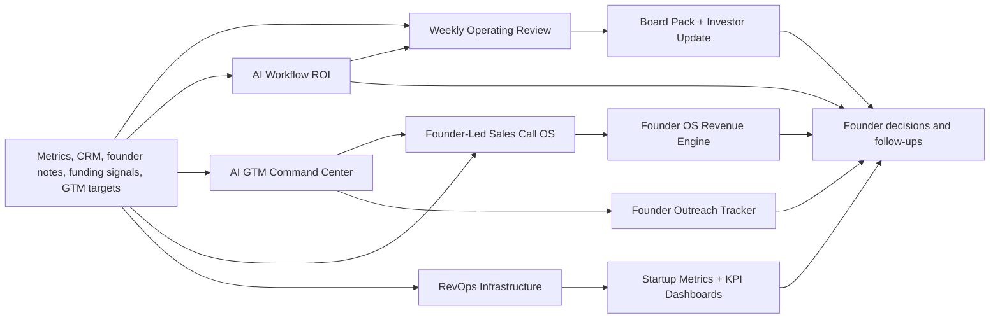

# Founder OS

A modular operating system library for early-stage founders who need reusable cadences, templates, and decision workflows instead of scattered notes.

<!-- FOUNDER_OS_STANDARD_README -->

## The founder problem

Early-stage founders usually do not fail because they lack dashboards. They lose execution quality when priorities, investor updates, GTM follow-ups, hiring decisions, and weekly reviews live in different tools with no operating rhythm.

## What this repo does

- organizes founder operating cadences into reusable templates
- maps the broader Founder OS repo ecosystem
- gives operators a starting point for weekly review, outreach, and founder communication
- keeps the system copyable for a company-specific fork

## What a founder gets in 10 minutes

- a repo map for choosing the right module
- weekly operating review template
- founder DM template
- sample operating cadence
- starter structure for a company operating system

## Before and after

Before:

- operating rhythm spread across docs, spreadsheets, and memory
- unclear weekly review structure
- no reusable template for founder follow-up
- portfolio repos that feel disconnected

After:

- one umbrella map for the Founder OS library
- copyable operating templates
- clear cadence for weekly founder review
- clean path into GTM, revenue, AI, metrics, and investor modules

## Who this is for

- early-stage founders
- Founder's Office teams
- BizOps operators
- RevOps operators
- startup generalists
- students learning startup operations

## Quick start

- Fork the repo on GitHub.
- Open `docs/repo-map.md` first.
- Copy `templates/weekly-operating-review-template.md` into your company workspace.
- Use `examples/sample-operating-cadence.md` to set the first weekly rhythm.

## How to fork and use this for your company

1. Click Fork.
2. Rename the repo if needed.
3. Replace template language with your company name, current stage, goals, and operating cadence.
4. Link the Founder OS modules your team will actually use first.
5. Move reusable templates into Google Docs, Notion, Airtable, Linear, Asana, ClickUp, or your internal ops tracker.
6. Keep private customer, employee, investor, or company data out of public forks.

### Non-technical path

- Replace one template: `templates/weekly-operating-review-template.md`.
- Edit one map: `docs/repo-map.md`.
- Run no code.
- Read one output first: your copied weekly review template.

## Input format

- company stage and current operating priorities
- weekly meeting cadence
- team owners and decision forums
- links to the Founder OS modules you want to adopt

The default sample data and examples are synthetic, anonymized, or template-only unless the repo explicitly documents a public source. Keep private customer, prospect, employee, investor, borrower, merchant, payment, or company data out of public forks.

## Output files

- `docs/repo-map.md`: umbrella map of the portfolio
- `templates/weekly-operating-review-template.md`: weekly review structure
- `templates/founder-dm-template.md`: founder outreach starter
- `examples/sample-operating-cadence.md`: example rhythm to adapt

## Example founder workflow

- Monday: choose the operating problem for the week.
- Tuesday: copy the matching template.
- Wednesday: assign owners and metrics.
- Thursday: connect the template to the relevant Founder OS module.
- Friday: close decisions and update the cadence.

## Customization guide

Customize these before using the repo for a real company:

- company stage and operating cadence
- meeting names and owners
- template sections
- linked modules
- decision artifacts

## Where this fits in the Founder OS

This is the umbrella repo. Use it to navigate the Founder OS library, then fork the specific module that solves the current operating problem: AI leverage, GTM research, sales-call learning, revenue diagnosis, weekly review, board reporting, RevOps infrastructure, metrics definitions, or founder outreach.

## Why this matters

This is not a generic portfolio index. It is the front door for a modular founder operating system.

## Roadmap

- add more company-context templates
- add sample operating packets
- add Notion and Google Docs export paths
- add cross-repo onboarding checklist

## Contributing

See [CONTRIBUTING.md](CONTRIBUTING.md) if present. Practical improvements are welcome when they make the workflow easier to fork, run, or adapt.

## License

MIT License. See [LICENSE](LICENSE).

## Built by

Built by Shubham Singh, a founder-facing operator focused on RevOps, GTM systems, startup metrics, AI workflows, and operating systems for early-stage teams.

## Use this in your company

Fork it, replace the sample inputs with your company context, and run the workflow. Start with the main output listed in the Quick Start section. Keep private data out of public forks.

## If you are a Founder's Office candidate

Use this repo to understand how a founder-facing operator turns messy inputs into decisions, cadence, and execution artifacts. Fork it, adapt it to a real company example, and write a short case note explaining what changed.

---

## Detailed implementation notes

The founder-facing guide above is the fastest path. The original repo-specific notes are preserved below for deeper implementation context.

An open-source operating system for early-stage founders, Founder Office teams, RevOps operators, and startup generalists.

## Problem This Solves

Early-stage startups do not usually break because they lack dashboards. They break because the operating rhythm is unclear: priorities are scattered, GTM follow-ups live in memory, investor updates take too long, CRM data is messy, and weekly reviews do not drive decisions.

## How It Helps

- Gives founders reusable workflows for weekly reviews, GTM research, sales call intelligence, revenue visibility, investor updates, RevOps, outreach, and KPI tracking.
- Connects separate tactical repos into one founder-facing operating system.
- Helps operators copy the templates, adapt the systems, and build a cleaner execution cadence without starting from scratch.

## When To Fork This

- Fork this if you are building an operating cadence for a seed or Series A startup.
- Fork it if you are joining a founder as Founder Office, BizOps, RevOps, GTM ops, or Chief of Staff.
- Fork it if you want templates and examples for turning messy startup workflows into repeatable systems.

## Use This In Your Company

This repo is designed to be forked into an internal company workflow. Fork it, replace the sample inputs with your company context, and keep only the parts that match your operating cadence. No permission request or sales call is needed before using it; the repo is the handoff. Check the license if you plan to redistribute your version.

- Use it as the umbrella operating system for an early-stage company.
- Start with one module: weekly review, GTM, RevOps, investor updates, outreach, or metrics.
- Copy only the module you need if you do not want the full system.

## Minimum Edits To Make It Yours

Change these first:

| Edit | Where | Why |
|---|---|---|
| Pick the first operating module. | `docs/repo-map.md` | Keeps the fork focused on one company problem instead of a broad toolkit. |
| Rewrite the weekly review template. | `templates/weekly-operating-review-template.md` | Makes the cadence match your founder, team, and KPI rhythm. |
| Rewrite the outreach template. | `templates/founder-dm-template.md` | Aligns GTM or partnership messaging with your market. |
| Replace module links with your active repos/tools. | `README.md` and `docs/repo-map.md` | Turns the umbrella repo into your internal operating index. |

You can leave the roadmap, contribution notes, and overall repo architecture alone on the first fork. Start with one module, use it for a week, then add the next module.

## Start Here

| Module | What It Does | Repo |
|---|---|---|
| Weekly Operating Review | Turns metrics into priorities, risks, team asks, and investor-safe updates. | [founder-weekly-operating-review-agent](https://github.com/shubham1502-hue/founder-weekly-operating-review-agent) |
| AI Workflow ROI | Ranks workflows by automation ROI, risk, payback period, and hire-vs-automate decisions. | [founder-ai-workflow-roi-os](https://github.com/shubham1502-hue/founder-ai-workflow-roi-os) |
| Board Pack / Investor Updates | Converts startup KPIs into board-ready narratives and decision lists. | [board-pack-investor-update-agent](https://github.com/shubham1502-hue/board-pack-investor-update-agent) |
| AI GTM Command Center | Scores target accounts and drafts human-approved founder outreach. | [ai-gtm-command-center](https://github.com/shubham1502-hue/ai-gtm-command-center) |
| Sales Call Intelligence | Turns founder-led sales call notes into objections, deal risks, rescue actions, and narrative experiments. | [founder-led-sales-call-os](https://github.com/shubham1502-hue/founder-led-sales-call-os) |
| RevOps Infrastructure | Documents CRM, reporting, handoffs, automations, and CEO visibility. | [revops-infrastructure-playbook](https://github.com/shubham1502-hue/revops-infrastructure-playbook) |
| Founder Outreach | Tracks founder/operator outreach and follow-up reminders. | [founder-outreach-tracker](https://github.com/shubham1502-hue/founder-outreach-tracker) |
| Startup Metrics | Defines metrics, formulas, SQL logic, benchmarks, and operator interpretation. | [startup-metrics-playbook](https://github.com/shubham1502-hue/startup-metrics-playbook) |

## What You Can Reuse

- weekly business review format
- investor update structure
- founder outreach tracker
- GTM account research workflow
- CRM and RevOps templates
- startup metric definitions
- operating cadence templates
- repo angle mapping for founder DMs

## Clone This If You Are

- a founder trying to build your first operating system
- a Founder Office hire setting up weekly business reviews
- a RevOps operator building CRM and reporting from scratch
- a startup analyst trying to understand metrics beyond dashboards
- a student building a portfolio around startup operations and business analytics

## System Overview

## Recommended Operating Cadence

| Day | Habit | Output |
|---|---|---|
| Monday | Review metrics and blockers | weekly operating review |
| Tuesday | Prioritize GTM accounts | account brief and DM queue |
| Wednesday | Inspect pipeline and CRM hygiene | RevOps action list |
| Thursday | Prepare investor-safe narrative | update draft |
| Friday | Close decisions and follow-ups | founder action list |

## Ways To Customize This

- Replace sample metrics with your company KPIs.
- Map the RevOps templates to HubSpot, Zoho, Pipedrive, or Attio.
- Adapt the weekly review for SaaS, D2C, marketplace, fintech, or services businesses.
- Add your own investor update format.
- Connect the outreach tracker to your existing Google Sheet.
- Add a Notion or Google Sheets front end.

## Good First Forks

1. Adapt Founder OS for a SaaS startup.
2. Adapt Founder OS for a D2C startup.
3. Adapt Founder OS for a marketplace startup.
4. Adapt Founder OS for a fintech startup.
5. Adapt Founder OS for a founder-led services business.

## Roadmap

See [ROADMAP.md](ROADMAP.md).

## Built By

Shubham Singh - Founder Office / RevOps operator building reusable systems for early-stage founders.

[GitHub](https://github.com/shubham1502-hue) | [LinkedIn](https://linkedin.com/in/shubham9616)

## License

MIT
