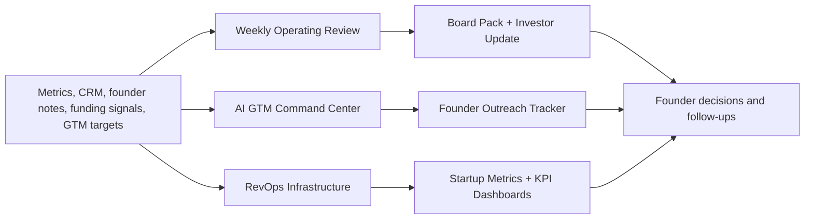

# Founder OS

An open-source operating system for early-stage founders, Founder Office teams, RevOps operators, and startup generalists.

## Problem This Solves

Early-stage startups do not usually break because they lack dashboards. They break because the operating rhythm is unclear: priorities are scattered, GTM follow-ups live in memory, investor updates take too long, CRM data is messy, and weekly reviews do not drive decisions.

## How It Helps

- Gives founders reusable workflows for weekly reviews, GTM research, revenue visibility, investor updates, RevOps, outreach, and KPI tracking.
- Connects separate tactical repos into one founder-facing operating system.
- Helps operators copy the templates, adapt the systems, and build a cleaner execution cadence without starting from scratch.

## When To Fork This

- Fork this if you are building an operating cadence for a seed or Series A startup.
- Fork it if you are joining a founder as Founder Office, BizOps, RevOps, GTM ops, or Chief of Staff.
- Fork it if you want templates and examples for turning messy startup workflows into repeatable systems.

## Use This In Your Company

- Use it as the umbrella operating system for an early-stage company.
- Start with one module: weekly review, GTM, RevOps, investor updates, outreach, or metrics.
- Copy only the module you need if you do not want the full system.

## Minimum Edits To Make It Yours

- templates/weekly-operating-review-template.md
- templates/founder-dm-template.md
- docs/repo-map.md
- module links for your stack

The fastest path is: fork the repo, replace the inputs above, run the demo or open the template, then adjust only the parts that reflect your company's workflow.

## Start Here

| Module | What It Does | Repo |
|---|---|---|
| Weekly Operating Review | Turns metrics into priorities, risks, team asks, and investor-safe updates. | [founder-weekly-operating-review-agent](https://github.com/shubham1502-hue/founder-weekly-operating-review-agent) |
| Board Pack / Investor Updates | Converts startup KPIs into board-ready narratives and decision lists. | [board-pack-investor-update-agent](https://github.com/shubham1502-hue/board-pack-investor-update-agent) |
| AI GTM Command Center | Scores target accounts and drafts human-approved founder outreach. | [ai-gtm-command-center](https://github.com/shubham1502-hue/ai-gtm-command-center) |
| RevOps Infrastructure | Documents CRM, reporting, handoffs, automations, and CEO visibility. | [revops-infrastructure-playbook](https://github.com/shubham1502-hue/revops-infrastructure-playbook) |
| Founder Outreach | Tracks founder/operator outreach and follow-up reminders. | [founder-outreach-tracker](https://github.com/shubham1502-hue/founder-outreach-tracker) |
| Startup Metrics | Defines metrics, formulas, SQL logic, benchmarks, and operator interpretation. | [startup-metrics-playbook](https://github.com/shubham1502-hue/startup-metrics-playbook) |

## What You Can Reuse

- weekly business review format
- investor update structure
- founder outreach tracker
- GTM account research workflow
- CRM and RevOps templates
- startup metric definitions
- operating cadence templates
- repo angle mapping for founder DMs

## Clone This If You Are

- a founder trying to build your first operating system
- a Founder Office hire setting up weekly business reviews
- a RevOps operator building CRM and reporting from scratch
- a startup analyst trying to understand metrics beyond dashboards
- a student building a portfolio around startup operations and business analytics

## System Overview

## Recommended Operating Cadence

| Day | Habit | Output |
|---|---|---|
| Monday | Review metrics and blockers | weekly operating review |
| Tuesday | Prioritize GTM accounts | account brief and DM queue |
| Wednesday | Inspect pipeline and CRM hygiene | RevOps action list |
| Thursday | Prepare investor-safe narrative | update draft |
| Friday | Close decisions and follow-ups | founder action list |

## Ways To Customize This

- Replace sample metrics with your company KPIs.
- Map the RevOps templates to HubSpot, Zoho, Pipedrive, or Attio.
- Adapt the weekly review for SaaS, D2C, marketplace, fintech, or services businesses.
- Add your own investor update format.
- Connect the outreach tracker to your existing Google Sheet.
- Add a Notion or Google Sheets front end.

## Good First Forks

1. Adapt Founder OS for a SaaS startup.
2. Adapt Founder OS for a D2C startup.
3. Adapt Founder OS for a marketplace startup.
4. Adapt Founder OS for a fintech startup.
5. Adapt Founder OS for a founder-led services business.

## Roadmap

See [ROADMAP.md](ROADMAP.md).

## Built By

Shubham Singh — Founder Office / RevOps operator building reusable systems for early-stage founders.

[GitHub](https://github.com/shubham1502-hue) · [LinkedIn](https://linkedin.com/in/shubham9616)

## License

MIT
